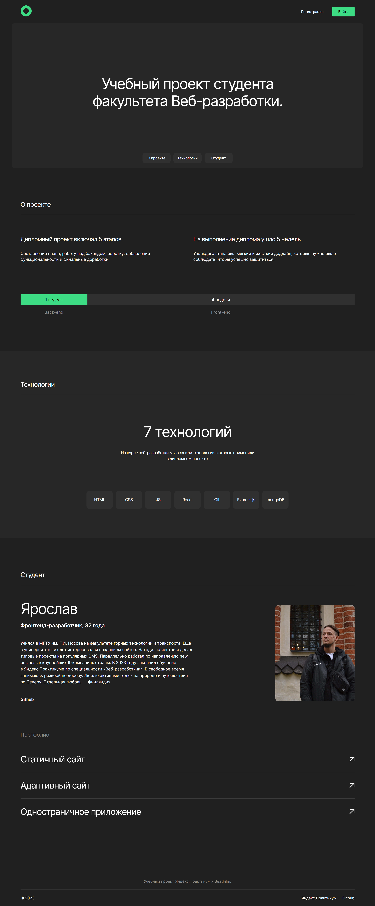

# movies-explorer-frontend

Репозиторий для проекта `Movies-explorer`, включающий фронтенд приложения со следующими возможностями: авторизации и регистрации пользователей, операции с фильмами (избранное, фильтры).



Что было сделано:
* настроена инфраструктура и создан сервер на express;
* подключена база данных, созданы схемы и модели ресурсов API;
* реализовано логирование, аутентификация и авторизация на сервере;
* бэкенд задеплоен на Яндекс Облако;
* свёрстаны компоненты на React, разметка портирована в его формат;
* описана логика и вёрстка страниц регистрации, логина, редактирования профиля, сохранённых фильмов;
* реализованы асинхронные GET- и POST-запросы к API;
* проработаны авторизованные и неавторизованные состояния, сохранение фильмов в профиле;
* полученные фильмы фильтруются на стороне клиента.

Инструменты и стек:
* HTML
* CSS
* React
* Express
* MongoDB
* NodeJS
* API
* Nginx
* JWT
* Postman

## Pull Request

<https://github.com/Yaroslav-Chertov/movies-explorer-frontend/pull/2>

## Инструкция по установке

```
git clone https://github.com/Yaroslav-Chertov/movies-explorer-frontend.git
```
```
npm install
```
```
npm start
```

